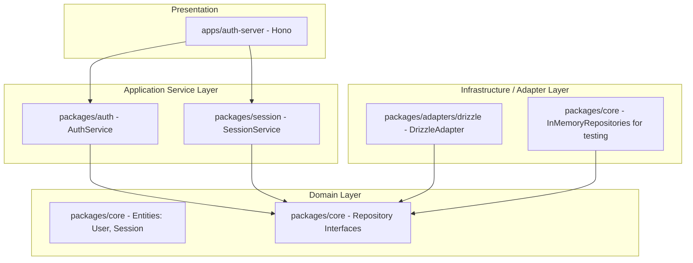

# AuthGate Architecture & Design Patterns

This document explains the architecture design, layout, and software design patterns used in the **AuthGate** IAM platform.

---

## 1. Clean Architecture Boundaries

AuthGate is architected to keep business rules independent of databases, web frameworks, UI components, and external libraries.



### Dependency Rules
- **Domain Layer (`packages/core`)**: Depends on nothing. It defines domain types and repository signatures.
- **Service Layer (`packages/auth`, `packages/session`)**: Depends only on the Domain Layer and shared utilities. It knows nothing about SQL, Hono, HTTP headers, or Drizzle.
- **Infrastructure / Adapter Layer (`packages/adapters/drizzle`)**: Implements Domain repository contracts using SQL / Drizzle query builders.
- **Presentation Layer (`apps/auth-server`)**: Coordinates boot-time configuration (wiring the database to services) and maps HTTP inputs to Service executions.

---

## 2. Design Patterns Implemented

### A. Repository Pattern
To decouple persistence logic from the business services, we use repository interfaces.

Example interface in [@authgate/core](file:///home/mdspl-sujith/sujith/authGate/packages/core/src/domain/repositories.ts):
```typescript
export interface UserRepository {
  findById(id: string): Promise<User | null>;
  findByEmail(email: string): Promise<User | null>;
  create(user: Omit<User, "id" | "createdAt" | "updatedAt">): Promise<User>;
}
```

The service uses these repositories as contracts. The actual queries are written in the adapter layer (e.g. [@authgate/drizzle](file:///home/mdspl-sujith/sujith/authGate/packages/adapters/drizzle/src/repositories.ts)):
```typescript
export class DrizzleUserRepository implements UserRepository {
  constructor(private readonly db: any) {}
  
  async findByEmail(email: string): Promise<User | null> {
    const results = await this.db.select().from(users).where(eq(users.email, email)).limit(1);
    return results[0] || null;
  }
  // ...
}
```

### B. Dependency Injection (DI)
Instead of hardcoding database queries or using global connection singletons inside our services, we pass dependencies via the constructor.

Example in [@authgate/auth](file:///home/mdspl-sujith/sujith/authGate/packages/auth/src/auth.service.ts):
```typescript
export class AuthService {
  constructor(
    private readonly userRepo: UserRepository,
    private readonly tokenRepo: VerificationTokenRepository
  ) {}
  
  // Registration and validation logic using this.userRepo
}
```

This pattern makes writing unit tests extremely easy since we can inject mocks or memory implementations:
```typescript
const memoryAdapter = createInMemoryAdapter();
const authService = new AuthService(memoryAdapter.users, memoryAdapter.verificationTokens);
```

### C. Adapter Pattern
To pass the Drizzle database connection to the bootloader, we wrap it in a `drizzleAdapter` function. This adapter returns a cohesive object matching the abstract `DatabaseAdapter` interface required by the core:

Example in [@authgate/drizzle](file:///home/mdspl-sujith/sujith/authGate/packages/adapters/drizzle/src/index.ts):
```typescript
export function drizzleAdapter(db: any): DatabaseAdapter {
  return {
    users: new DrizzleUserRepository(db),
    sessions: new DrizzleSessionRepository(db),
    verificationTokens: new DrizzleVerificationTokenRepository(db),
  };
}
```

### D. Service Layer Pattern
All business workflows (such as user creation, token expiration checking, password hashing, and cookie age validations) are locked inside the service layer (`AuthService` and `SessionService`).
Route handlers in the HTTP server (`apps/auth-server`) only serve as entry gates:
1. Parse and validate JSON parameters using Zod.
2. Delegate to the service.
3. Set cookies and send standard formatted JSON responses.

---

## 3. Public Initialization Flow

This is how the modules are bootstrapped at startup in the API Server:

```typescript
import { createAuthGate } from "@authgate/core";
import { drizzleAdapter } from "@authgate/drizzle";
import { AuthService } from "@authgate/auth";
import { SessionService } from "@authgate/session";
import postgres from "postgres";
import { drizzle } from "drizzle-orm/postgres-js";

// 1. Establish database connection
const queryClient = postgres(process.env.DATABASE_URL);
const db = drizzle(queryClient);

// 2. Wrap connection in adapter
const databaseAdapter = drizzleAdapter(db);

// 3. Bootstrap core gate
const authGate = createAuthGate({ database: databaseAdapter });

// 4. Inject repositories into service layer
const authService = new AuthService(
  authGate.database.users,
  authGate.database.verificationTokens
);
const sessionService = new SessionService(
  authGate.database.sessions
);
```
